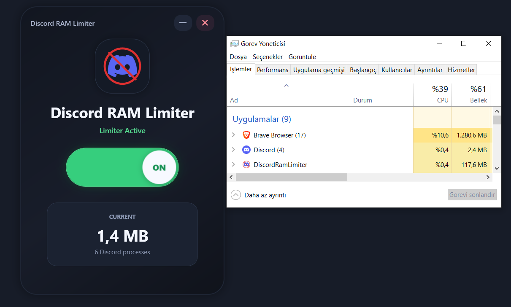

# Discord RAM Limiter

Discord RAM Limiter is a small Windows desktop app that monitors Discord memory usage and can trim Discord's working set while it runs in the background.

The app uses the native Windows `SetProcessWorkingSetSize(process.Handle, -1, -1)` call on detected Discord processes when the limiter is enabled.

## Screenshot



## Download

Download the latest build from the GitHub Releases page:

[Download from GitHub Releases](https://github.com/farajyeet/discord-ram-limiter/releases/tag/1)

## Features

- Modern WPF desktop interface.
- Live Discord RAM usage display.
- Discord process count display.
- Animated ON/OFF limiter switch.
- Safe background monitor loop with cleanup on exit.
- Minimize-to-tray behavior.
- System tray notification when the app is minimized.
- Tray menu with `Open` and `Exit` actions.
- Supports Discord Stable, Canary, PTB, and Development process names.

## Supported Discord Processes

The limiter looks for these process names:

```text
Discord
DiscordCanary
DiscordPTB
DiscordDevelopment
```

## Requirements

To run the release build:

- Windows 10 or newer.
- .NET Desktop Runtime, if using the framework-dependent release.

To build from source:

- Windows 10 or newer.
- .NET 10 SDK with Windows Desktop support.

## Build From Source

Clone or download the repository, then run:

```powershell
dotnet restore .\DiscordRamLimiter.sln
dotnet build .\DiscordRamLimiter.sln
```

## Run From Source

```powershell
dotnet run --project .\DiscordRamLimiter\DiscordRamLimiter.csproj
```

## Create A Local Release Build

This creates a small framework-dependent release folder:

```powershell
dotnet publish .\DiscordRamLimiter\DiscordRamLimiter.csproj -c Release --self-contained false -p:DebugType=None -p:DebugSymbols=false -o .\publish\DiscordRamLimiter-github-release
```

The output contains:

```text
DiscordRamLimiter.exe
DiscordRamLimiter.dll
DiscordRamLimiter.deps.json
DiscordRamLimiter.runtimeconfig.json
```

## Disclaimer

This project is not affiliated with Discord.

Use at your own risk. Trimming process working sets may affect Discord performance or stability, and Windows may restore memory usage as Discord continues running.

## License

This project is licensed under the MIT License.
